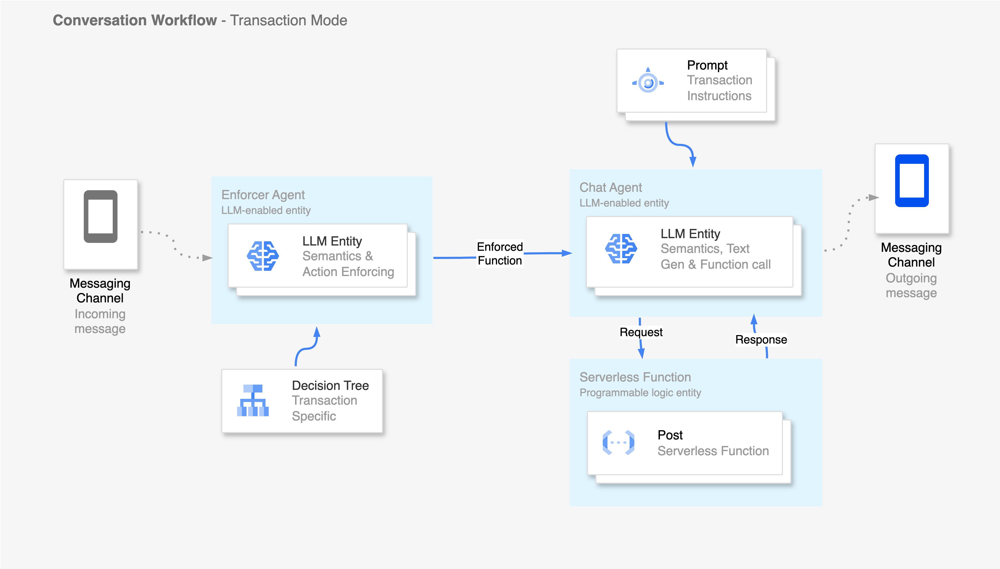
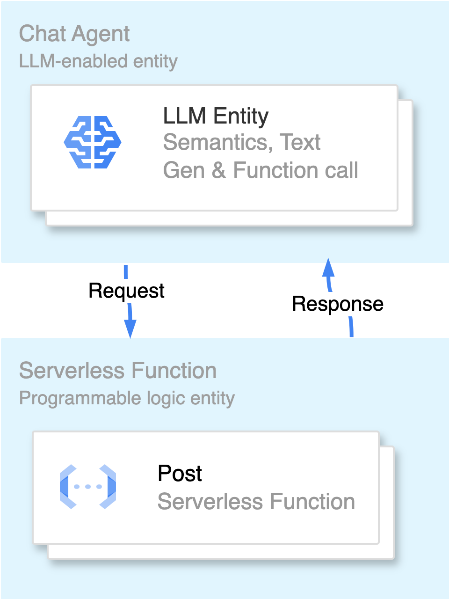

*****************
Conversation Workflows
*****************

This page is intended to serve as the main reference point to how AI-enabled Conversations are
executed in the Halatech system.

Overview
========
Conversations workflow is designed to provide a durable, reliable, and dynamic environment for executing and orchestrating the complexity of AI-enabled human-to-machine conversations. With the combination of technologies such as RAG (Retrieval-Augmented Generation), LLM (Large Language Model) intelligence, and the Twilio Communications Suite, the Conversations workflow provides a highly flexible and adaptable environment to properly orchestrate complex human-to-machine communications.

Key Components
==============

Chat Agent
----------
The chat agent is the central artificial intelligence component in the conversation workflow. It is responsible for providing textual responses to customers or calling LLM functions on their behalf. To ensure the chat agent handles conversations seamlessly, we provide a chat agent system prompt (see Prompts) that contains a description of the current workflow mode, as well as all necessary contextual information and instructions needed for a smooth interaction with each customer.

Enforcer Agent
--------------

The enforcer agent can be thought of as the chat agent's supervisor. It is designed to enable more accurate function calling by the chat agent. Function calling is an integral part of all services managed by the conversation workflow. Thus, the need for a system that accurately calls a function when required or refrains from calling it when not needed motivated the development of the enforcer agent. The enforcer agent uses the enforcer system prompt and conversation history to instruct the chat agent on whether or not a function call is necessary.

.. note::

   In the conversation workflow, all functions that need to be called are enforced. The enforcer is the sole entity responsible for determining which functions to call and when to call them.

Prompts
-------
Prompts are plain, human-readable text containing contextual information and instructions for an agent to use in performing a single task or a series of tasks. With prompts, we can provide all the necessary information an agent needs to handle simple discussions in Discussion Mode or complex transactions in Transaction Mode. In the Halatech system, there are essentially two types of prompts.

- **System Prompt**: This is the main prompt containing the most important set of information to guide the agent in performing a specific task. For example, each organization has a unique system prompt used when the conversation workflow is in Discussion Mode. Additionally, for each transaction on an organization's account, there is a unique system prompt that provides the main instructions and context needed by the AI agent to perform that particular transaction.

- **Message Prompt**: Message prompts are additional dynamic contextual information used to provide more context to the AI agent on the fly, enabling more relevant responses. These are RAG-enabled prompts, retrieved and appended to the most recent message. As the conversation evolves, the previous message prompt is discarded and replaced with a newly generated, more relevant one.

Prompts are central to Halatech's AI-enabled workflows, and they directly influence the quality of the experience our clients' customers receive.

LLM-Functions
-------------
LLM functions are similar to prompts in that they are described using plain text and some JSON structural elements. In Halatech's conversation workflow, LLM functions are used to inform an agent (whether chat or enforcer) about the correct output format required at runtime. When defining LLM functions, the desired output is a set of arguments or parameters that the agent should generate. These parameters or arguments serve as inputs to well-defined functions within the workflow. By allowing the agent to generate accurate just-in-time arguments, we can programmatically extract these arguments from the agent's output and directly invoke the corresponding function written in JavaScript.
`See openAI function schema <https://platform.openai.com/docs/guides/function-calling>`_

.. tip::

   When an agent calls a function, no plain text response is generated by the agent unless explicitly instructed to do so. In such cases, the plain text is attached to an argument within the agent’s list of generated arguments. For example: ``{"arg1": "", "arg2": "", "plainTextArg": "some AI-generated plain text"}``

Workflow Signals
-------------

Operation Modes
===============
The Conversations workflow is architected with three distinct operational modes, each designed to maintain a clear separation of concerns. These modes are as follows:

- **Relay Mode**
- **Discussion Mode**
- **Transaction Mode**

Discussion Mode
---------------
In **Discussion Mode**, the primary objective of the Conversations workflow is to execute Retrieval-Augmented Generation (RAG) operations to produce the most relevant and natural response to an incoming message. To achieve this, each organization utilizing the Conversations workflow maintains a dedicated datastore containing comprehensive information pertinent to their operations. This includes frequently asked questions, details about products and services, and general business information deemed relevant to customers. The integrity and relevance of the QA mode responses are directly dependent on the quality and completeness of this datastore.

Upon receiving a new message event from a customer, the Conversations workflow initiates a RAG operation utilizing OpenAPI vector embeddings and the Halatech Vector Postgres Database. The operation retrieves specific pieces of information most relevant to the incoming message. This retrieved content is then used as contextual input for a Large Language Model (LLM), which generates a response that is both relevant and natural. The Conversations workflow also ensures a stateful environment, maintaining a record of all messages within a given conversation thread to support ongoing dialogue.

*Prompting*

Prompting is designed to provide instruction and context necessary to facilitate seamless and coherent interactions while the conversations workflow is in Discussion Mode. Since prompts are tailored to each organization, a conversation's **system prompt** typically includes the following elements:

- Greeting style, tone, and mood
- Organization-specific customer assistant information
- Current date and time

Within discussion mode, in addition to the **system prompt**, relevant data (often formatted as question and answer pairs) related to the most recent incoming message is dynamically appended to the message thread as a **message prompt**. This process provides the necessary contextual information to generate an accurate and contextually relevant response. Once a response is generated, the dynamically retrieved context is discarded, and the cycle repeats with the reception of a new message signal. It is important to note that the system prompts remain unchanged throughout the conversation mode; only the context retrieved via the RAG process is discarded after each use.

.. note::

   Dialogue occurring in an instance of the conversation workflow is stored as a thread of all inbound and outbound messages in order w.r.t time. The **system prompt** is located at the start of the conversation (i.e. the first message) and the **message prompt** maintains its location at the bottom of the message thread as the conversation evolves.

*Functions*

In discussion mode, functions play a crucial role at enabling the AI agent  execute specific task. Concretely, in decision mode a major task to be executed is **Mode Switching** which is enabled by the ``initiateTransaction`` function. 

.. note::
    **Mode Switching** involves altering the mode of the Conversation Workflow from one mode to another. Several stateful variables and managed to preserve the mode as the workflow continues  to run.

The ``initiateTransaction`` function is responsible for transitioning the conversation workflow from **Discussion Mode** to **Transaction Mode**. It utilizes the decision-making capabilities of Large Language Models (LLMs). Given a set of supported transaction types within an organization (e.g., Booking a Room, Cancelling a Booking), the LLM uses this function to decide on the appropriate transaction to initiate. With ``initiateTransaction``, the LLM generates an output containing the necessary arguments required for executing the mode switch within the conversation workflow. The `openAI function schema <https://platform.openai.com/docs/guides/function-calling>`_ is used to define these functions and is provided as follows.

.. code-block:: json

   {
     "name": "initiateTransaction",
     "description": "
       Starts the following transactions ONLY WHEN ABSOLUTELY NECESSARY.

       1. Transaction ID: {{id_1}}; Transaction Description: {{desc_1}}
       2. Transaction ID: {{id_2}}; Transaction Description: {{desc_2}}
     ",
     "parameters": {
       "type": "object",
       "properties": {
         "transactionID": {
           "type": "string",
           "description": "The transaction ID for the intended transaction"
         },
         "userMessage": {
           "type": "string",
           "description": "The incoming user message."
         }
       },
       "required": ["transactionID", "userMessage"]
     }
   }

.. note::
    The data containing all transactions assigned to an organization is always fetched and stored in the workflow instance during initiation. This transaction information is then used to populate the list of transactions in ``initiateTransaction``.

Functions in decision mode are **enforced**. For example, an hospitality business can have a enforcer decision map that determines when a `food order` or `room booking` transaction should be be kicked off by the ``initiateTransaction`` function while in discussion mode. This decision map can have the following conditions (Read more on `Decision maps <https://platform.openai>`_): 

.. code-block:: json

   {
     "question": "Has the customer clearly indicated that they would like to start the process of booking a room reservation?",
     "answer": {
       "no": {
         "question": "Has the customer clearly indicated that they would like to start the process of ordering food or drinks?",
         "answer": {
           "no": {
             "functionName": "doNothing"
           },
           "yes": {
             "functionName": "initiateTransaction"
           }
         },
       },
       "yes": {
         "functionName": "initiateTransaction"
       }
     },
   }

Transaction Mode
------------------
Transaction mode is another mode available in the conversation workflow. This mode is well-suited for handling conversations that involve some form of *transaction*. By transaction, we refer to any interaction where a customer (human) provides information in exchange for a service. For example the following can be considered as a transaction:

- Booking a hotel room
- Checking subscriber information
- Booking a cab
- Placing a food order

Transaction mode is similar to discussion mode in many ways, as it utilizes both a custom system prompt and a RAG-enabled message prompt to ensure the conversation flows smoothly. Each transaction is assigned a unique prompt, which is programmatically fetched and inserted into the workflow during mode switching. A transaction prompt typically outlines the step-by-step flow of the intended business transaction, guiding the AI agent to follow the correct sequence and generate appropriate responses.

Serverless functions play a crucial role in transactions. The conversation workflow is designed to be as generic as possible, accommodating multiple purposes. Serverless functions allow for the definition of tailored logic, HTTP calls, and responses specific to a given transaction. For example, in a Car Hire transaction, a serverless function can implement a custom HTTP request to hire a car or perform validation tasks such as checking availability. Each transaction is allocated a maximum of one serverless function, which can be used to perform various tasks. The chat agent can be instructed (via a prompt) to specify the appropriate action type (``actionType``) during a function call to a serverless function. This action type can then be conditionally utilized within the serverless function to execute the specific action.

All calls to a serverless function are handled by the ``post`` LLM function call. The ``post`` LLM function is used by the chat agent to provide the correct arguments for post-function implementation in the code. The argument generated by the chat agent via the LLM function is appended to the body of an HTTP POST call to the serverless endpoint for that particular transaction. This body argument can be extracted and further utilized for specific tasks within the serveless function implementation. Accurate calls to the ``post`` function by the chat agent are critical to the reliability and performance of a transaction.

To ensure closed-loop feedback from a serverless function, the conversation workflow provides an interface to communicate back to the running workflow that invoked it. The conversation workflow receives an ``externalFeedback`` signal, which enables a closed-loop system when an external call to a serverless function is made.

When a function call, such as post or any other valid function, is made, the corresponding function is executed, and its response is used to generate a text response within the workflow. This text response is then sent as an outbound message. This process completes the cycle, and the workflow will wait for any further incoming messages for the duration of the conversation. To learn how to build and manage a transaction end-to-end see `Build Transaciton from Scratch <https://ht-docs.readthedocs.io/en/latest/overview.html#>`_.

.. _conversation_workflow: