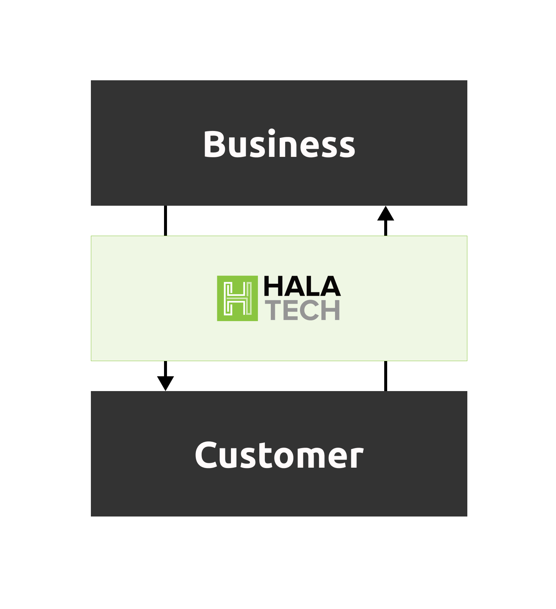

Halatech AI
===================================

Welcome to the Halatech AI Docs website!

**Application Summary**  

Our approach to building intelligent chat-based applications is rooted in modern advancements. We view Large Language Models (LLMs) as the human-language-based operating system for both simple and complex applications. As LLMs evolve and improve in interpreting human language and intentions, the potential of this framework continues to grow.

The Halatech AI platform is dedicated to creating applications that enhance seamless business-to-customer relationships. Our offerings include intelligent customer service, self-service applications, and customer behavior analytics.

.. note::

   This project is under active development.

Documentation Structure
--------

.. toctree::
   
   overview
   getting-started
   workflows
