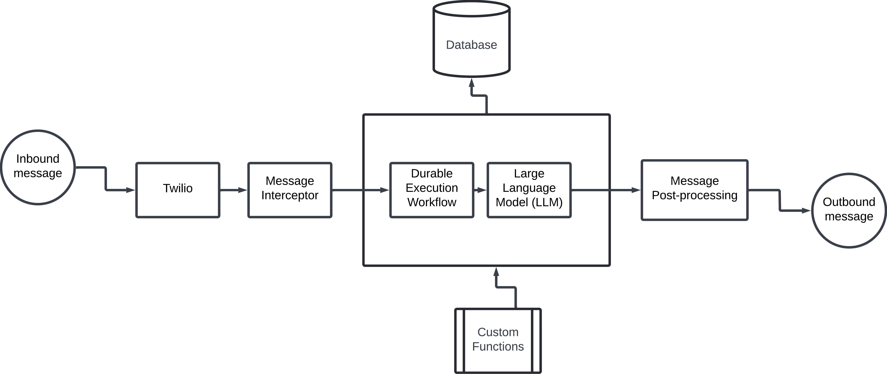

Overview
============

Halatech High-level architecture

Auth0
----------------------------------

User Management and Authentication
~~~~~~~~~~~~~~~~~~~~~~~~~~~~~~~~~~

The Halatech system architecture leverages the Auth0 User Management and Authentication system to manage access for organization admins and agents. Auth0 is also utilized to manage user roles and permissions, ensuring controlled access to various parts of the application.

Application Security
~~~~~~~~~~~~~~~~~~~~

Auth0 secures and manages critical components of the Halatech application, including the Agent Desktop and Flex Contact Center. This ensures that only authorized users can access these areas, enhancing the overall security of the system.

Enterprise Configuration
~~~~~~~~~~~~~~~~~~~~~~~~

For enterprise organizations, Halatech provides the capability to configure Single Sign-On (SSO) for their users. We do this via auto0 and this allows for seamless integration with existing identity providers and simplifies the login process for enterprise users.

Twilio
----------------

Twilio is an integral part of our current architecture. Twilio provides end-to-end multi-channeled communications APIs that we use to facilitate communication within the application. 

We use the Twilio Conversations API and Twilio Flex to ensure every conversation initiated by business customers is well managed from start to finish. Twilio Flex also provides a contact center that we utilize for enabling a human-in-the-loop style of communications. This means that while the AI agent manages the conversation with a customer, a human can monitor or step in (if needed) to ensure ultra-smooth and secure business-customer interaction.

Twilio Conversations
~~~~~~~~~~~~~~~~~~~~
Twilio Conversations offers a unified API that empowers our client customers deliver text messages across multiple preferred channels, including SMS, MMS, WhatsApp, Facebook Messenger, and Google's Business Messages. This single API facilitates both one-way messaging and conversational chat, enabling us to build robust messaging solutions for every client. By leveraging Twilio Conversations, Halatech seamlessly manages and enhance customer interactions across diverse platforms.

Twilio Flex
~~~~~~~~~~~
With Twilio Flex, Halatech is able to seamlessly manage a virtual contact center for all client. 

Temporal
----------------
The distributed nature of Halatech's architecture makes the durable execution services offered by Temporal essential to our framework. We use Temporal to manage long-running processes and workflows. These workflows can encompass a single conversation thread between a customer and a client. Additionally, we use these extended workflows to design and orchestrate end-to-end customer experiences for services provided by businesses. Temporal is integral to Halatech’s AI chat-based framework, ensuring we consistently deliver highly reliable services.

Supabase
----------------

We leverage Supabase, a Postgres-backed database to store comprehensive information about clients and their access to the Halatech system. Each client serviced by Halatech has separate records and custom tables containing metadata, Twilio account configurations, Auth0 configurations, and business data, which is transformed into FAQs. Additionally, we use Supabase to manage clients' custom datastores for storing large inventory information required for the AI-enabled services they offer, such as a food menu for a restaurant.

Our utilization of Supabase includes the following features, with plans to expand to more of Supabase's offerings:

- Data Encryption
- Vector Database for Retrieval-Augmented Generation (RAG)
- Database Functions
